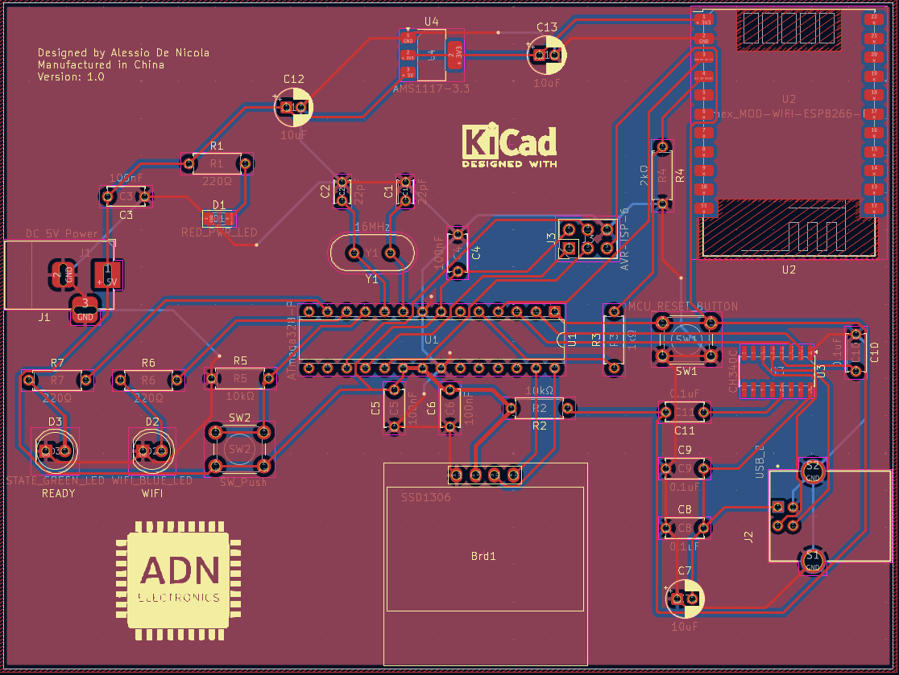
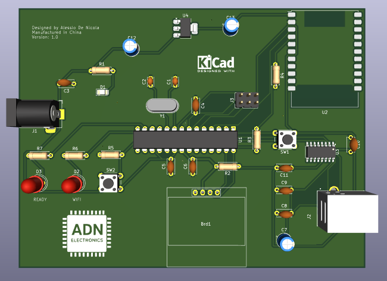

# MCU Weather Station

The heart of the board is the ATmega328P microcontroller, it also features a 6-pin AVR-ISP connector for burning the bootloader and a USB connector with serial driver for programming the microcontroller. For connectivity, an ESP8266 Wi-Fi module is provided, connected to the ATmega328P.
The boards were ordered from China via the JLCPCB website (5 pcs at a cost of 31 EUR) and the components will be assembled and soldered by myself.
The board schematic can be found in schematic/MCU_Weather_Station.pdf from this git repository.

__Why this board?__

The purpose of the board is to provide a simple but practical example of an online weather station that will use the api.open-meteo.com server for web requests, weather information such as temperature, humidity and time zone will be shown on the OLED display. I will develop the firmware using Arduino IDE.

__PCB view:__

__3D view:__

__Components:__

- 1x ATmega328P DIP-28
- 1x CH340C serial driver SMD
- 1x ESP8266 Olimex_MOD-WIFI-ESP8266-DEV module
- 1x OLED 128x64 SSD1306 display
- 1x AMS1117 voltage regulator (from 5V to 3.3V)
- 1x USB-B THT connector
- 1x DC Barrel Jack 5V THT
- 1x 16 MHz crystal
- 1x 5mm blue LED
- 1x 5mm green LED
- 1x SMD red power LED
- 2x 6mm THT push buttons
- 1x 2x3 AVR-ISP header
- 7x Resistors THT (3x 220Ω | 2x 10kΩ | 1x 1kΩ | 1x 2kΩ)
- 8x 100nF (0.1uF) ceramic capacitors THT
- 2x 22pF ceramic capacitors THT
- 3x 10uF electrolytic radial capacitors THT
